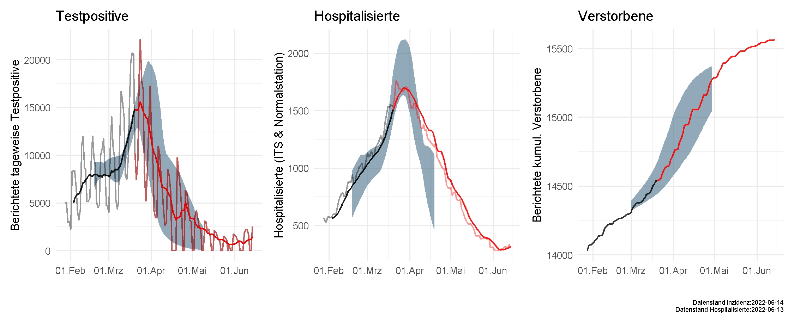

# IMISE-Epidemiologisches-Bulletin-22

Additional Details for the Epidemiological bulletin 22 [ Epidemiological bulletin 22](https://www.imise.uni-leipzig.de/sites/www.imise.uni-leipzig.de/files/files/uploads/Medien/bulletin22_covid19_sachsens_2021_03-21_website.pdf) of the [IMISE Leipzig](https://www.imise.uni-leipzig.de/) regarding the development of COVID-19 in Saxony and Germany.

### Comparison observed data with described scenarios

Black line shows data used for modelling included in the bulletin, red indicates data observed later.

